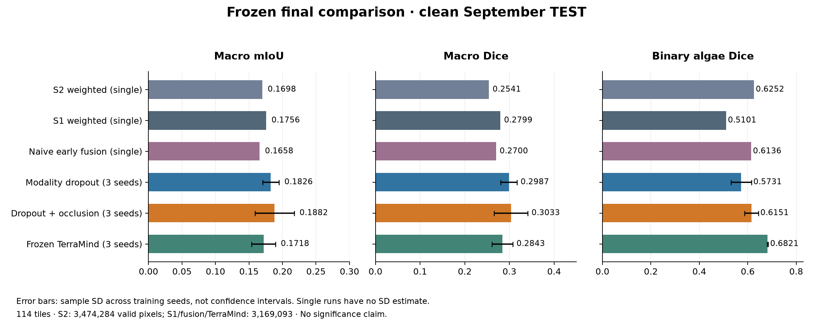
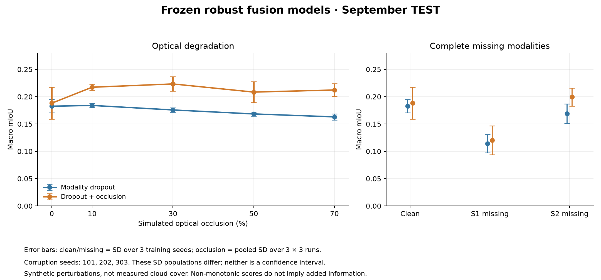
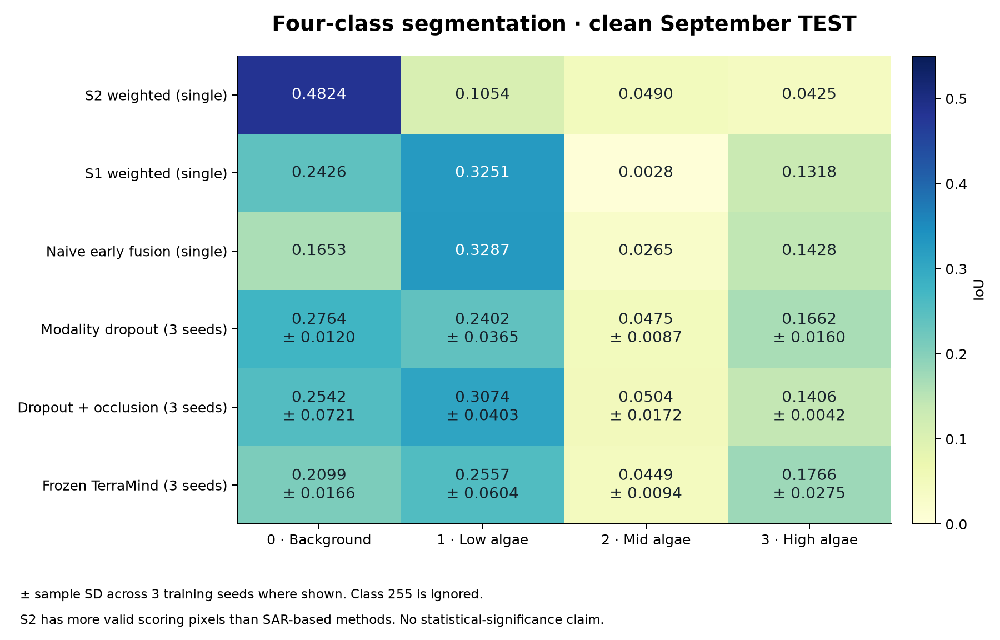

# Robust Multimodal GeoAI for Algal Bloom Mapping

An independent research project inspired by the Newcastle GeoAI Summer School, studying four-class algal-bloom mapping with Sentinel-1 radar and Sentinel-2 optical imagery. Controlled degradation experiments, three-seed robust training and a frozen TerraMind benchmark show that resilience to simulated optical occlusion does not remove the difficulty of temporal generalisation.

## Research Question

**How robust are multimodal GeoAI segmentation models when optical satellite imagery is degraded or one sensing modality is unavailable?**

## Why This Matters

Combining optical and radar inputs does not guarantee resilience to sensor failure. This project measures that weakness, tests two controlled training interventions, and reports the remaining limitations on September acquisitions.

## Key Contributions

- Rasterio alignment and a manifest-based pipeline for corresponding 224×224 S1/S2 tiles.
- Optical, SAR and five-channel early-fusion baselines; modality dropout and optical-occlusion-aware training with seeds **42, 7, 123**.
- A deterministic robustness benchmark, frozen multimodal TerraMind comparison and validation-only uncertainty diagnostics.
- Frozen final test reporting with per-date analysis and an explicit [scientific audit](docs/SCIENTIFIC_AUDIT.md).

## Data and Temporal Split

The regional Lough Neagh dataset covers 12 acquisition dates in 2025. Labels are **0 background, 1 low algae, 2 mid algae, 3 high algae; 255 is ignored**. S2 uses B04/B03/B02; S1 uses VV/VH GAMMA0_TERRAIN dB. Imagery is aligned to B04 with bilinear resampling; labels use nearest-neighbour only.

| Split | Tiles | Dates |
|---|---:|---|
| Train | 621 | 2025-01-31, 2025-03-12, 2025-04-08, 2025-04-09, 2025-05-16, 2025-05-18, 2025-05-21, 2025-08-12 |
| Validation | 111 | 2025-01-01, 2025-06-20 |
| TEST | 114 | 2025-09-08, 2025-09-21 |

[The fixed split](configs/split_v1.yaml) and [tile manifest](results/tile_manifest.csv) separate dates, not regions. Phase 7 evaluated the frozen final models after validation-based selection, with no post-Phase-7 tuning or checkpoint selection. **Audit qualification:** an earlier unweighted S2 TEST result exists from Phase 2D. The TEST set was therefore accessed before Phase 7; that historical result is preserved. See [test-access history](docs/SCIENTIFIC_AUDIT.md#test-access-history).

## Methods

### Optical baseline

DeepLabV3-MobileNetV3-Large with RGB reflectance divided by 10,000, clipped to [0,1], and ImageNet-normalized. Validation comparisons selected inverse-square-root class-weighted cross entropy over unweighted loss and balanced sampling.

### SAR baseline

The same family with a two-channel stem and VV/VH standardized using training-pixel statistics. Invalid SAR pixels are ignored in the target. [SAR preprocessing](docs/SAR_PREPROCESSING.md).

### Naive multimodal fusion

Five-channel early fusion concatenates separately normalized RGB and VV/VH. DeepLab runs use 10 epochs, batch size 8, fixed optimizer settings and spatially matched flips/rotations. Model selection uses validation macro mIoU.

### Modality dropout

After normalization, each sample keeps both modalities with probability 50%, zeros S1 with probability 25%, or zeros S2 with probability 25%. Both are never removed together.

### Optical-occlusion-aware training

The same dropout policy, with half of intact both-modality samples receiving coherent simulated optical occlusion at a fraction sampled uniformly from 10–70%. Occluded optical values are zeroed **after normalization**. These controlled synthetic perturbations are not measured real cloud cover.

### Frozen TerraMind benchmark

`terramind_v1_tiny`, RGB + S1RTC, with a frozen pretrained backbone and lightweight decoder. The final `[B,196,192]` token output becomes a `[B,192,14,14]` map and is upsampled to four-class 224×224 logits. Decoder-only training uses 10 epochs, batch size 4, AMP and the locked class weights.

### Uncertainty diagnostics

Validation-only probability calibration, entropy, error-detection AUROC and risk–coverage analysis. A three-model probability ensemble adds mutual information and disagreement. No calibration fitting was performed.

## Final Held-Out Test Results

Phase 7, 114 tiles across two September dates. **± is sample standard deviation across three training seeds**, not a confidence interval. Conventional baselines are single runs.

| Model | Runs | Macro mIoU | Macro Dice | Binary algae Dice |
| --- | --- | --- | --- | --- |
| S2 weighted | Single | 0.1698 | 0.2541 | 0.6252 |
| S1 weighted | Single | 0.1756 | 0.2799 | 0.5101 |
| Naive early fusion | Single | 0.1658 | 0.2700 | 0.6136 |
| Modality dropout | 3 seeds | 0.1826 ± 0.0123 | 0.2987 ± 0.0182 | 0.5731 ± 0.0421 |
| Dropout + occlusion training | 3 seeds | 0.1882 ± 0.0293 | 0.3033 ± 0.0380 | 0.6151 ± 0.0289 |
| Frozen TerraMind | 3 seeds | 0.1718 ± 0.0177 | 0.2843 ± 0.0235 | 0.6821 ± 0.0025 |



Occlusion-trained fusion has the numerically highest macro mIoU; TerraMind has the highest binary algae Dice. Binary detection does not measure four-class severity quality. S2 scores **3,474,284** valid pixels versus **3,169,093** for SAR/fusion/TerraMind under their existing nodata rules, so this is not strictly pixel-matched. No statistical-significance claim is made. [Full results](docs/FINAL_TEST_RESULTS.md).

## Robustness Under Optical Degradation

Validation established the progression: naive fusion fell from **0.2425** clean mIoU to **0.0133** at 70% simulated optical occlusion (one trained model, three corruption seeds). Across three training seeds, dropout reached **0.1620 ± 0.0054**, and occlusion training **0.2547 ± 0.0161** at 70%. Validation robustness AUC was 0.1016 / 0.1912 / 0.2646 for original fusion / dropout / occlusion training.



TEST at 70% occlusion gives **0.1630 ± 0.0055** for dropout and **0.2122 ± 0.0115** for occlusion training. These summaries pool **nine training-seed × corruption-seed runs**; clean/missing-sensor summaries use three training seeds. Missing S1 gives **0.1141 ± 0.0166 / 0.1204 ± 0.0264**, and missing S2 gives **0.1690 ± 0.0176 / 0.1993 ± 0.0164**, respectively.

The non-monotonic test curve does not mean obscuring imagery adds information. Corruption-aware training changes prediction behaviour and class balance under the September distribution, while retaining numerically higher macro segmentation performance under optical degradation than dropout alone.

## Temporal Generalisation

| Model | Runs | Validation macro mIoU | TEST macro mIoU |
| --- | --- | --- | --- |
| S2 weighted | Single | 0.2274 | 0.1698 |
| S1 weighted | Single | 0.2349 | 0.1756 |
| Naive early fusion | Single | 0.2425 | 0.1658 |
| Modality dropout | 3 seeds | 0.2725 ± 0.0157 | 0.1826 ± 0.0123 |
| Dropout + occlusion training | 3 seeds | 0.2648 ± 0.0089 | 0.1882 ± 0.0293 |
| Frozen TerraMind | 3 seeds | 0.2771 ± 0.0138 | 0.1718 ± 0.0177 |

Every method loses four-class performance, consistent with substantial temporal/domain shift. This is a main finding, not a basis for further model selection. S2 and TerraMind struggle particularly on September 8; mid-algae IoU remains low across methods. [Per-date results](docs/FINAL_TEST_RESULTS.md#per-date-behaviour).



## TerraMind Foundation-Model Benchmark

Three-seed training is complete. Frozen TerraMind has strong validation segmentation (**0.2771 ± 0.0138** mIoU) and the highest TEST binary algae Dice (**0.6821 ± 0.0025**), but does not consistently outperform robust DeepLab for four-class temporal generalisation. This is frozen-feature benchmarking, not full fine-tuning. [Completed validation evidence](docs/TERRAMIND_REPRODUCIBILITY.md) is verified from checkpoint metadata; older partial exports are identified as historical there.

## Uncertainty Findings

Ensembling reduces clean validation ECE/NLL/Brier relative to the mean individual occlusion-trained model. Error detection remains modest: disagreement AUROC is **0.5984** at 70% occlusion, and missing-modality behaviour is inconsistent. Softmax entropy is not automatically calibrated uncertainty. [Uncertainty](docs/UNCERTAINTY_DIAGNOSTICS.md) and [ensemble diagnostics](docs/ENSEMBLE_UNCERTAINTY.md) detail the limitations.

## Qualitative Results


The first two test tiles, both September 8, from the saved Phase 7 figure. “Robust” is occlusion-trained fusion seed 42; TerraMind also uses seed 42. Dark/green/yellow/red/grey denote background/low/mid/high/ignore. The error panel uses S2 target validity, so it illustrates errors rather than reproducing the SAR-valid quantitative denominator. Predictions outside valid labels are not verified classifications.

## Reproduction

Start with [the reproduction guide](docs/REPRODUCTION.md), [preprocessing](docs/PREPROCESSING.md) and locked configs. Data/checkpoints must be supplied separately; historical Windows DeepLab and Colab TerraMind environments differ.

The [TerraMind Colab notebook](notebooks/TerraMind_Colab.ipynb) mounts Drive, restores the optional model cache, extracts data to local `/content`, and persists outputs to Drive. Training uses `--data-root /content/geoai_data/SummerSchool_Subset`, seeds 42/7/123, batch size 4 and 10 epochs. [Colab workflow](docs/COLAB_WORKFLOW.md).

For **presentation-only reproduction**, in an environment with Matplotlib:

```bash
python scripts/render_final_presentation.py
```

This reads saved summaries and redraws three final charts without loading data/checkpoints or running inference. Phase 8 ran no new experiments. Historical experiment entry points are documented for inspection, not as instructions to repeat the closed TEST evaluation.

## Repository Structure

```text
configs/       fixed split and experiment settings
src/           raster datasets, models, training and evaluation
scripts/       experiment entry points and presentation renderer
notebooks/     TerraMind Colab workflow
results/       small saved CSV/JSON experiment records
figures/       generated research figures
docs/          methods, results, audit and portfolio summaries
data/          setup instructions; raw data ignored
checkpoints/   local only; ignored
```

## Limitations

- Small regional dataset, few acquisition dates and only two September test dates; strong temporal shift, no cross-region claim.
- Severe class imbalance, especially high-algae pixels; synthetic masks omit real cloud physics, shadows and cloud-mask errors.
- Earlier test access and unequal valid-pixel support qualify evaluation; seed variation is not a significance test.
- Uncertainty-based failure detection remains moderate/inconsistent; TerraMind covers frozen features only.
- External data/checkpoints and some original environment records are needed for complete reproduction.

## Data / Licensing

Original Summer School data, TIFFs, ZIP archives, model checkpoints and model caches are **not distributed**. Obtain data separately under the original source terms. Code, small result summaries, documentation and selected generated figures are retained where appropriate. The prepared labels/archive license and permission to publish data-derived figures remain unresolved; no source-data or software license is invented. [Data provenance](docs/DATA_PROVENANCE.md).

## Project Status

Experiments and the frozen Phase 7 comparison are complete; Phase 8 finalises documentation and presentation. No post-Phase-7 tuning or checkpoint selection occurred. Visibility is unchanged, with public release pending licensing review. See [project summary](docs/PROJECT_SUMMARY.md), [portfolio summary](docs/PORTFOLIO_SUMMARY.md) and [scientific audit](docs/SCIENTIFIC_AUDIT.md).
