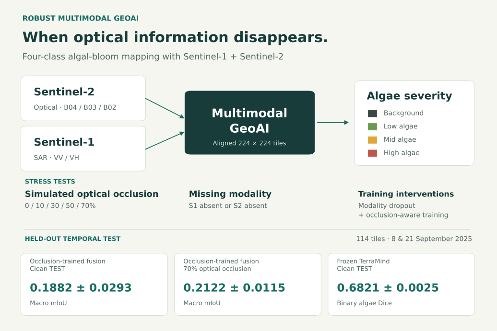
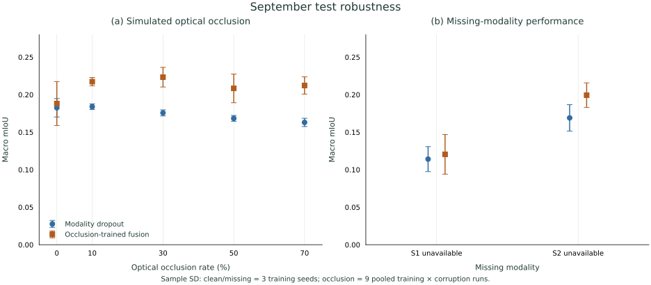
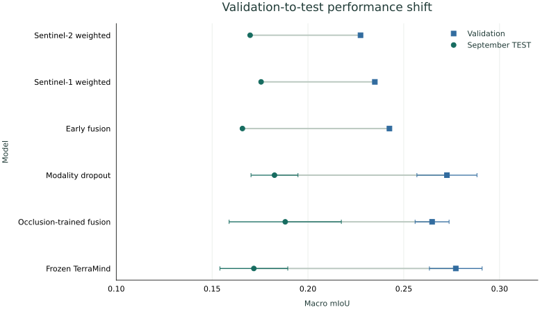

# Robust Multimodal GeoAI for Algal Bloom Mapping

An independent study of optical–radar segmentation, missing-sensor robustness and temporal generalisation over Lough Neagh.

**[Project website](https://uossheldon.github.io/robust-multimodal-geoai/)** · [Methods](docs/METHODS.md) · [Final results](docs/FINAL_TEST_RESULTS.md) · [Reproduction](docs/REPRODUCTION.md)



## Research question

How robust are multimodal GeoAI segmentation models when optical satellite imagery is degraded or one sensing modality is unavailable?

Sentinel-2 RGB (B04/B03/B02) and Sentinel-1 VV/VH radar are aligned to 224×224 tiles. The fixed date-level split contains 621 training, 111 validation and 114 test tiles. Models predict background, low, mid and high algae, with label 255 ignored.

## Key findings

1. **Naive early fusion was brittle under optical degradation.** Its initial validation macro mIoU fell from 0.2425 clean to 0.0133 at 70% simulated optical occlusion.
2. **Robustness-aware training improved resilience.** Modality dropout reduced missing-sensor failures, while occlusion-aware training improved performance under simulated optical degradation.
3. **Temporal generalisation remained difficult.** All evaluated models lost four-class performance on the two September test dates.

## Final test comparison

| Model | Runs | Macro mIoU | Macro Dice | Binary algae Dice |
|---|---|---:|---:|---:|
| Sentinel-2 weighted | 1 | 0.1698 | 0.2541 | 0.6252 |
| Sentinel-1 weighted | 1 | 0.1756 | 0.2799 | 0.5101 |
| Early fusion | 1 | 0.1658 | 0.2700 | 0.6136 |
| Modality dropout | 3 seeds | 0.1826 ± 0.0123 | 0.2987 ± 0.0182 | 0.5731 ± 0.0421 |
| Occlusion-trained fusion | 3 seeds | **0.1882 ± 0.0293** | **0.3033 ± 0.0380** | 0.6151 ± 0.0289 |
| Frozen TerraMind | 3 seeds | 0.1718 ± 0.0177 | 0.2843 ± 0.0235 | **0.6821 ± 0.0025** |

Multi-seed values report mean ± sample SD. The final comparison is descriptive rather than a statistical ranking. An earlier exploratory unweighted Sentinel-2 run had already been evaluated on the test dates, and valid-pixel support differs between Sentinel-2-only and SAR-dependent methods; see the [scientific audit](docs/SCIENTIFIC_AUDIT.md).

## Robustness

The benchmark uses simulated optical occlusion at 0/10/30/50/70% plus separate missing-Sentinel-1 and missing-Sentinel-2 conditions.

Occlusion-trained fusion reached **0.2122 ± 0.0115 macro mIoU at 70% optical occlusion** on the September test dates. Complete Sentinel-1 loss remained challenging.



## Temporal generalisation

All six methods declined from validation to September test performance. Occlusion-trained fusion achieved the highest clean four-class test macro mIoU, while TerraMind achieved the strongest binary algae Dice.



## TerraMind

A frozen `terramind_v1_tiny` RGB+S1RTC backbone with a lightweight segmentation decoder was evaluated across three training seeds.

- Validation macro mIoU: **0.2771 ± 0.0138**
- Test macro mIoU: **0.1718 ± 0.0177**
- Test binary algae Dice: **0.6821 ± 0.0025**

The benchmark uses frozen features rather than full fine-tuning. TerraMind robustness under simulated optical corruption was not evaluated. See [TerraMind benchmark](docs/TERRAMIND.md).

## Repository structure

```text
configs/       Experiment settings and date split
data/          External-data layout
src/           Data pipelines, models, training and evaluation
scripts/       Experiment and presentation entry points
results/       Metrics, manifests and compact experiment records
figures/       Publication-ready aggregate figures
site/          Static project website and results explorer
docs/          Methods, results, provenance and reproduction notes
tests/         Lightweight path-handling tests
```

## Reproduction

Repository and presentation checks do not require the dataset or a GPU:

```bash
python scripts/check_lightweight.py
python scripts/check_presentation.py
python -m http.server 8000 --bind 127.0.0.1 --directory .site-build
```

Experimental reproduction requires the external prepared dataset and pretrained weights. See [Reproduction](docs/REPRODUCTION.md) and the [TerraMind Colab workflow](docs/COLAB_WORKFLOW.md).

## Data availability

The project uses data and teaching materials provided through the Newcastle University GeoAI Summer School. The prepared source dataset, labels, checkpoints and raster-derived qualitative imagery are not redistributed.

The public repository contains independently implemented code, experiment configuration, aggregate results, figures and documentation. See [Data provenance](docs/DATA_PROVENANCE.md).

## Limitations

The study covers one region and two test dates, with severe class imbalance and unequal modality-dependent scoring support. Binary algae detection is not equivalent to four-class severity mapping. Uncertainty diagnostics are exploratory and do not establish a deployment-safety mechanism.

## Documentation

- [Methods](docs/METHODS.md)
- [Final test results](docs/FINAL_TEST_RESULTS.md)
- [Reproduction](docs/REPRODUCTION.md)
- [Data provenance](docs/DATA_PROVENANCE.md)
- [Scientific audit](docs/SCIENTIFIC_AUDIT.md)
- [TerraMind benchmark](docs/TERRAMIND.md)
- [Uncertainty and calibration](docs/UNCERTAINTY.md)
- [Colab workflow](docs/COLAB_WORKFLOW.md)
