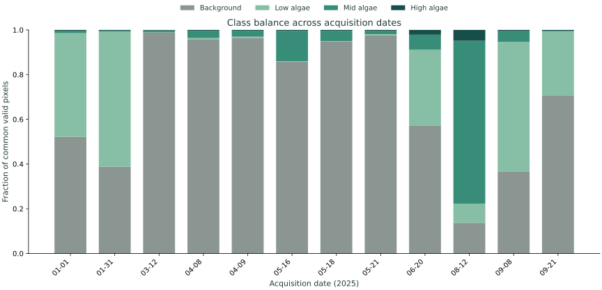
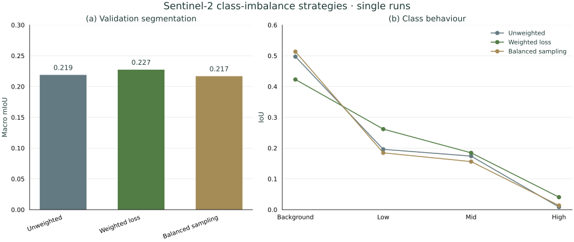

# Methods

## Dataset and fixed split

The completed study used 12 dated Sentinel-2/Sentinel-1 acquisitions over Lough Neagh and four-class algae masks from the Newcastle University GeoAI Summer School. See [data provenance](DATA_PROVENANCE.md). The original teaching notebooks used binary algae targets; this project preserved `0` background, `1` low, `2` mid, `3` high algae and `255` ignore.

The [fixed split](../configs/split_v1.yaml) and [846-tile manifest](../results/tile_manifest.csv) are authoritative:

| Split | Dates in 2025 | Tiles |
|---|---|---:|
| Train | 01-31, 03-12, 04-08, 04-09, 05-16, 05-18, 05-21, 08-12 | 621 |
| Validation | 01-01, 06-20 | 111 |
| TEST | 09-08, 09-21 | 114 |

Dates do not cross sets; geographic coverage repeats across dates. This is temporal evaluation within one region, not geographic generalisation.

## Alignment and tile generation

Rasterio uses B04 as the reference grid (EPSG:32629). B03/B02 are read directly when grids match and warped otherwise; VV/VH are aligned with bilinear resampling. Labels use nearest-neighbour resampling only. Original grids differ: representative B04 is 2652×3200 at approximately 10.028483×10.024018 m; SAR is 2379×2985 near 10 m; masks are 2559×3088 at 10 m.

Full 224×224 non-overlapping pixel windows are retained at a minimum 20% common valid-pixel ratio. Optical nodata, SAR nodata/non-finite values and label 255 are excluded for manifest eligibility. Coordinates, validity, class counts and source references are recorded; datasets read rasters on demand without duplicated tile caches. [Per-date statistics](../results/per_date_statistics.csv) retain the complete inventory.

Runtime scoring support is model-specific: S2 uses aligned label validity, while SAR/fusion/TerraMind additionally ignore invalid SAR targets. Manifest eligibility counts are not each model's scoring denominator; see [scientific audit](SCIENTIFIC_AUDIT.md#evaluation-support).

## Sentinel-2 preprocessing

B04/B03/B02 form RGB. Divide DN by 10000, clip reflectance to [0,1], then apply ImageNet mean [0.485,0.456,0.406] and std [0.229,0.224,0.225]. Training applies matched horizontal/vertical flips and 90-degree rotations to image and mask. Labels remain discrete after every transform.

## Sentinel-1 preprocessing

VV/VH are GAMMA0_TERRAIN backscatter in dB, with nodata -9999. Invalid values are filled with channel means before standardization and invalid targets ignored. Train-only statistics are VV mean -22.144847395326/std 6.108021880184 and VH mean -32.467809385519/std 6.304149943967, fitted on 21,730,003 valid training pixels per channel. Reflectance scaling is not applied to SAR.

## Class imbalance and optical baseline selection

The selected loss is inverse-square-root TRAIN-frequency-weighted CrossEntropyLoss, normalized to mean weight 1, with ignore_index=255. Locked weights in class order are [0.243332998497, 0.709198873576, 0.651737877057, 2.395730250869]. No focal loss or combined loss-weighting/oversampling was used.

The unweighted optical baseline learned training data while validation plateaued. Its first-16-tile diagnostic reached only 0.184 training mIoU after 40 epochs; this was partial fitting, not successful near-memorization. The original subset contained 133224/361672/4443/3150 pixels for classes 0/1/2/3. A class-rich replacement subset (18982/16902/333131/61465 pixels) was inspected without changing the main experiment. Train class fractions were 0.7890/0.0929/0.1100/0.0081 versus validation 0.5516/0.3892/0.0452/0.0140 in the manifest-based diagnostic. Diagnostic records remain in [baseline diagnostics](../results/s2_deeplab/baseline_diagnostics.json).

A separate unweighted-loss sampling experiment assigned the highest class with at least 128 pixels and 1% of valid pixels; inverse-square-root stratum weights were capped at a 4:1 ratio. Background/low/mid/high strata contained 216/66/168/171 tiles. It did not improve over weighted loss. Validation-only selection retained weighted S2 (mIoU 0.2274), compared with unweighted 0.2189 and balanced sampling 0.2169. Full class behaviour remains in the saved [weighted](../results/s2_deeplab_weighted/) and [sampling](../results/s2_deeplab_balanced_sampling/) records.

## DeepLab baselines and early fusion

DeepLabV3-MobileNetV3-Large uses pretrained torchvision weights and a four-class output. Selected S2, S1 and naive fusion are conventional single-run baselines. SAR uses a two-channel input stem initialized by repeated mean RGB weights scaled by 3/2. Five-channel early fusion retains RGB stem weights and initializes VV/VH from mean RGB weights, in RGB,VV,VH order. Each modality is normalized separately before concatenation.

The controlled training budget is 10 epochs, batch size 8, AMP and AdamW (backbone LR 1e-5, classifier LR 1e-4, weight decay 1e-3). Checkpoints are selected by validation macro mIoU. Augmentations, optimizer policy and weighted loss remain fixed across the controlled fusion interventions.

## Modality dropout and occlusion-aware training

After normalization, deterministic sample-level dropout keeps both modalities with probability 0.50, zeros S1 with probability 0.25, and zeros S2 with probability 0.25. Both are never dropped simultaneously.

Occlusion-aware training adds exactly one change: among samples retaining both modalities, half remain clean and half receive spatially coherent simulated optical occlusion at a uniformly sampled fraction from 10% to 70%. Only normalized optical pixels are zeroed. Training masks use independent seeded randomness from evaluation masks. Training seeds are 42, 7 and 123.

| Condition | Original | Modality dropout | Modality dropout + occlusion training |
|---|---:|---:|---:|
| Clean | 0.2592 ± 0.0171 | 0.2725 ± 0.0157 | 0.2648 ± 0.0089 |
| Missing S1 | 0.1539 ± 0.0199 | 0.1886 ± 0.0188 | 0.1746 ± 0.0305 |
| Missing S2 | 0.0275 ± 0.0117 | 0.2104 ± 0.0263 | 0.2130 ± 0.0132 |
| 10% simulated optical occlusion | 0.1671 ± 0.0191 | 0.2170 ± 0.0139 | 0.2621 ± 0.0104 |
| 30% simulated optical occlusion | 0.0947 ± 0.0468 | 0.1870 ± 0.0106 | 0.2729 ± 0.0050 |
| 50% simulated optical occlusion | 0.0539 ± 0.0457 | 0.1702 ± 0.0049 | 0.2632 ± 0.0063 |
| 70% simulated optical occlusion | 0.0334 ± 0.0260 | 0.1620 ± 0.0054 | 0.2547 ± 0.0161 |

On validation, partial-occlusion training improves simulated optical-occlusion macro mIoU beyond modality dropout, with a small clean macro mIoU decrease.

The table reports three-training-seed validation means ± sample SD. Corruption runs are averaged within each training seed first. Original fusion here is a three-seed mean, distinct from the selected single-run baseline. No significance test establishes superiority.

## Robustness and missing-modality evaluation

The frozen corruption implementation creates a low-resolution random field, bicubically upsamples it and thresholds it into coherent irregular masks. Measured fractions are 0/10/30/50/70%, with fixed corruption seeds 101/202/303 and deterministic tile identities. Relevant models receive identical masks. Labels and SAR are unchanged. This is simulated optical occlusion, not real clouds, haze or shadows.

Occluded normalized optical pixels and completely missing normalized modalities use zero tensors. Missing S1 and missing S2 are separate conditions. The initial single-run naive-fusion validation mIoU fell from 0.2425 clean to 0.0133 at 70% occlusion; the corresponding later three-training-seed validation mean is 0.0334. These sampling populations must not be conflated. TerraMind's final role was clean benchmarking, without a robustness evaluation.

## Metrics and aggregation

Confusion counts exclude label 255. Per-class IoU is TP/(TP+FP+FN); Dice is 2TP/(2TP+FP+FN). Macro scores average the four classes. Binary algae scores merge classes 1–3 against background and do not replace severity segmentation. Date-pooled metrics derive from pooled confusion counts, not the arithmetic mean of date scores.

Final clean/missing-sensor uncertainty bars use sample SD across three training seeds. Final optical-occlusion bars pool nine training-seed × corruption-seed runs. These SDs describe different populations, not confidence intervals. [Final results](FINAL_TEST_RESULTS.md) and [scientific audit](SCIENTIFIC_AUDIT.md) preserve earlier TEST access and unequal scoring support.

