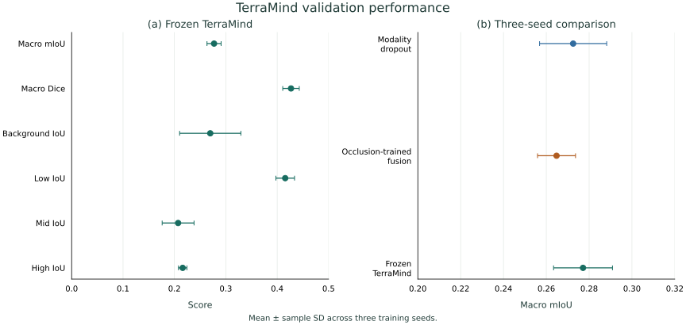

# Frozen TerraMind benchmark

A pretrained Earth-observation backbone was used to test whether frozen multimodal features support algae segmentation on the same aligned tiles and fixed split as the DeepLab experiments. This is a frozen-feature benchmark, not full fine-tuning.

## Model

- Backbone: `terramind_v1_tiny`
- Modalities: RGB + S1RTC
- Input size: 224×224
- Backbone state: frozen
- Trainable component: lightweight four-class segmentation decoder
- Model selection: validation macro mIoU
- Training seeds: 42, 7, 123

The decoder reshapes the final token output to a 14×14 feature map and upsamples through convolutional blocks to a four-class 224×224 prediction.

## Preprocessing

RGB uses B04/B03/B02, divided by 10000, clipped to [0,1], reordered RGB → BGR and multiplied by 255.

Sentinel-1 uses VV/VH GAMMA0_TERRAIN backscatter in dB. Invalid SAR values are excluded from the target mask and filled with the model normalization mean before normalization: mean [-10.930, -17.329], standard deviation [4.391, 4.459].

## Training

Each run uses:

- 10 epochs
- batch size 4
- mixed precision
- AdamW on decoder parameters only
- learning rate 1e-3
- weight decay 1e-3
- weighted cross-entropy with ignore label 255

## Validation

| Seed | Best epoch | Macro mIoU | Macro Dice |
|---:|---:|---:|---:|
| 42 | 7 | 0.283511 | 0.434891 |
| 7 | 5 | 0.261364 | 0.408358 |
| 123 | 10 | 0.286567 | 0.437345 |

| Metric | Mean ± sample SD |
|---|---:|
| Macro mIoU | 0.277148 ± 0.013754 |
| Macro Dice | 0.426864 ± 0.016074 |
| Background IoU | 0.269726 ± 0.059600 |
| Low-algae IoU | 0.415583 ± 0.018151 |
| Mid-algae IoU | 0.207178 ± 0.031039 |
| High-algae IoU | 0.216104 ± 0.008250 |
| Binary algae IoU | 0.496434 ± 0.012650 |
| Binary algae Dice | 0.663426 ± 0.011248 |

The machine-readable record is [terramind_validation.json](../results/terramind_validation.json).

## Final test

On the September test dates, TerraMind reached:

- Macro mIoU: **0.1718 ± 0.0177**
- Macro Dice: **0.2843 ± 0.0235**
- Binary algae IoU: **0.5176 ± 0.0029**
- Binary algae Dice: **0.6821 ± 0.0025**

Binary detection was comparatively strong, but four-class performance still declined from validation to test. TerraMind robustness under simulated optical corruption was not evaluated.

See [Final test results](FINAL_TEST_RESULTS.md) for the full comparison.
