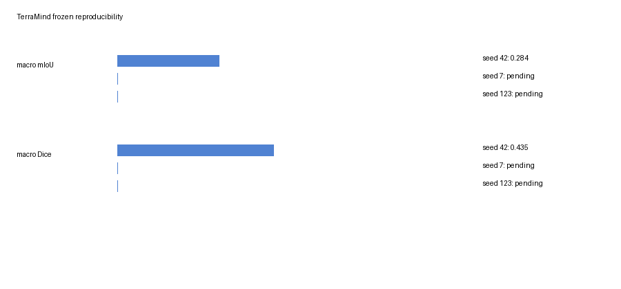
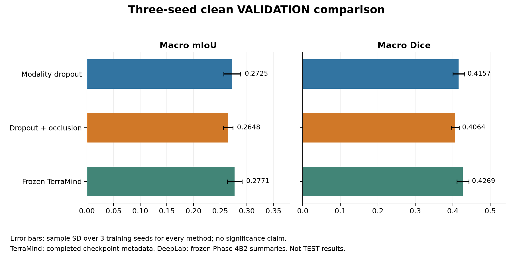

# Frozen TerraMind benchmark

A pretrained Earth-observation backbone tested whether frozen multimodal features supported algae segmentation on the same aligned tiles and fixed split as DeepLab. This was frozen-feature benchmarking, not full fine-tuning. The pretrained model was `ibm-esa-geospatial/TerraMind-1.0-tiny`, built through TerraTorch with RGB + S1RTC and mean modality-token merging.

## Benchmark design

The benchmark uses the validated Colab TerraMind setup:

- GPU: Google Colab T4
- TerraTorch: `1.2.13`
- TorchGeo: `0.9.0`
- Backbone: `terramind_v1_tiny`
- Modalities: `RGB` and `S1RTC`
- Input tile size: `224x224`
- TerraMind output used by the decoder: last feature output with shape `[B, 196, 192]`

The backbone is frozen. Only the segmentation decoder is trained.

## Fixed project choices

The experiment keeps the previous project setup fixed:

- Date-level split: `configs/split_v1.yaml`
- Expected manifest counts: 621 train tiles and 111 validation tiles
- Test dates excluded from all training/validation loaders: `2025-09-08`, `2025-09-21`
- Manifest: `results/tile_manifest.csv`
- Classes: `0 background`, `1 low algae`, `2 mid algae`, `3 high algae`
- Ignore label: `255`
- Model selection: validation macro mIoU
- TEST was excluded during training/selection; the final frozen comparison was evaluated separately.

## Preprocessing

The TerraMind dataset reads the aligned rasters listed in the manifest. It does not reuse DeepLab-normalized tensors.

### RGB

Input bands are B04/B03/B02. They are converted as follows:

1. Divide by `10000` to get reflectance.
2. Clip to `[0, 1]`.
3. Reorder RGB to BGR.
4. Multiply by `255`.

### S1RTC

Input bands are VV/VH in GAMMA0_TERRAIN dB.

- Nodata: `-9999`
- Non-finite and nodata pixels are excluded through the target mask.
- Invalid SAR values are filled with the TerraMind mean before normalization.
- TerraMind normalization:
  - mean `[-10.930, -17.329]`
  - std `[4.391, 4.459]`

## Decoder design

The decoder receives the last TerraMind feature output:

`[B, 196, 192] -> [B, 192, 14, 14]`

It then applies a lightweight convolutional upsampling head:

- Conv 192→128, GroupNorm, GELU, upsample ×2
- Conv 128→96, GroupNorm, GELU, upsample ×2
- Conv 96→64, GroupNorm, GELU, upsample ×2
- Conv 64→32, GroupNorm, GELU, upsample ×2
- Dropout2d `0.10`
- Conv 32→4

Output shape is `[B, 4, 224, 224]`.

## Training setup

The completed runs trained for 10 epochs with:

- batch size `4`
- mixed precision
- AdamW on decoder parameters only
- learning rate `1e-3`
- weight decay `1e-3`
- `CrossEntropyLoss(ignore_index=255)`
- locked class weights from the selected weighted DeepLab experiments: `[0.243332998497, 0.709198873576, 0.651737877057, 2.395730250869]`

The completed three-seed experiment used batch size `4`. All three seeds used the same locked settings.

## Completed validation results

| Training seed | Best validation epoch | Macro mIoU | Macro Dice |
| --- | --- | --- | --- |
| 42 | 7 | 0.283511 | 0.434891 |
| 7 | 5 | 0.261364 | 0.408358 |
| 123 | 10 | 0.286567 | 0.437345 |

| Validation metric | 3-seed mean ± sample SD | n |
| --- | --- | --- |
| Macro mIoU | 0.277148 ± 0.013754 | 3 |
| Macro Dice | 0.426864 ± 0.016074 | 3 |
| IoU 0 background | 0.269726 ± 0.059600 | 3 |
| IoU 1 low | 0.415583 ± 0.018151 | 3 |
| IoU 2 mid | 0.207178 ± 0.031039 | 3 |
| IoU 3 high | 0.216104 ± 0.008250 | 3 |
| Binary algae IoU | 0.496434 ± 0.012650 | 3 |
| Binary algae Dice | 0.663426 ± 0.011248 | 3 |

These are training-seed statistics, not an ensemble prediction. At headline precision the validation macro mIoU is **0.2771 ± 0.0138** and macro Dice **0.4269 ± 0.0161**. The supplied completed summary reported high-algae SD as 0.0083; saved checkpoint metadata gives 0.008249714, shown above at six decimals to make the precision distinction explicit. No recorded result was overwritten.

## Provenance reconciliation

[TERRAMIND_VALIDATION_EVIDENCE.json](TERRAMIND_VALIDATION_EVIDENCE.json) records each saved seed's validation metrics, binary metrics derived from its saved validation confusion matrix, checkpoint filenames and SHA-256 prefixes matching the final checkpoint inventory. The means agree with the supplied completed summary at the stated precision apart from the minor high-class SD rounding noted above.

The files `results/terramind_reproducibility/per_seed_results.csv`, `aggregate_results.csv`, `summary.json` and `seed_42_metrics.json` are **historical incomplete export snapshots**, preserved intact. Their missing values and incomplete export status do not describe the completed training. They are not the authoritative source for the current three-seed tables or figures. The old aggregation script reads those historical exports; do not rerun it expecting the completed summary until full original Colab metrics files have been restored. Runtime/VRAM for all three runs are not recoverable from the available checkpoint metadata and are not invented.

The comparison uses robust DeepLab **three-seed validation means**, not single selected runs. Dropout mIoU is 0.2725 ± 0.0157; occlusion-trained fusion is 0.2648 ± 0.0089. No significance claim is made. TerraMind's TEST mIoU is 0.1718 ± 0.0177 and binary algae Dice is 0.6821 ± 0.0025: strong binary detection does not establish superior severity segmentation or temporal generalisation.

## Final clean test and interpretation

Three-seed September test macro mIoU was **0.1718 ± 0.0177**, macro Dice **0.2843 ± 0.0235**, binary algae IoU **0.5176 ± 0.0029**, and binary algae Dice **0.6821 ± 0.0025**. Per-class IoUs and per-date performance are in [final results](FINAL_TEST_RESULTS.md). September 8 mIoU was 0.0965 ± 0.0433 versus 0.2335 ± 0.0100 on September 21: binary detection strength did not imply consistent four-class temporal generalisation. TerraMind robustness was not evaluated.

The validated Colab stack was Tesla T4 14.56 GB, torch 2.11.0+cu128, numpy 2.2.6, TerraTorch 1.2.13 and TorchGeo 0.9.0. Use the [Colab workflow](COLAB_WORKFLOW.md) for independent reproduction. Configurable `--data-root /content/geoai_data/SummerSchool_Subset` reconstructs paths from dates without DeepLab-normalized tensors or Windows manifest-path assumptions.
