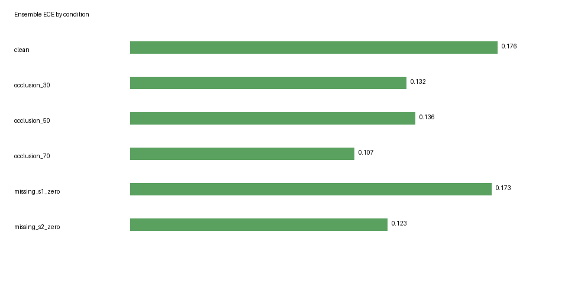
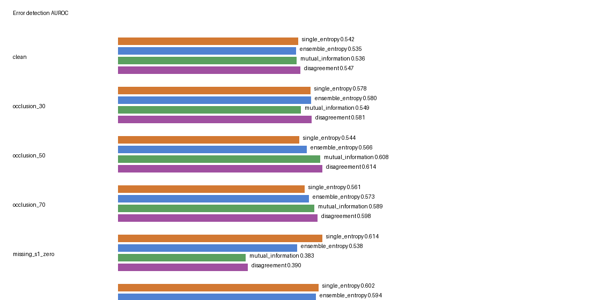

# Uncertainty and calibration

**Ensembling improved probability calibration, but uncertainty-based error detection remained modest and condition-dependent.**

All uncertainty experiments used validation dates only, frozen models and training seeds 42/7/123. Conditions were clean, 30/50/70% simulated optical occlusion, S1 missing and S2 missing. No calibration fitting, MC dropout, retraining or test uncertainty evaluation was performed.

## Calibration and probability metrics

| Method, clean validation | ECE | NLL | Multiclass Brier |
| --- | --- | --- | --- |
| modality_dropout (3-seed mean ± SD) | 0.1491 ± 0.0315 | 1.0248 ± 0.0906 | 0.6127 ± 0.0505 |
| occlusion_training (3-seed mean ± SD) | 0.2019 ± 0.0321 | 1.1407 ± 0.1090 | 0.6688 ± 0.0373 |
| original (3-seed mean ± SD) | 0.1279 ± 0.0093 | 1.0620 ± 0.0137 | 0.6025 ± 0.0120 |

Source: [aggregate_metrics.csv](../results/uncertainty/aggregate_metrics.csv). Values are mean ± sample SD over three training seeds; occlusion here uses fixed corruption seed 101, rather than the three-corruption-seed benchmark average. NLL and multiclass Brier use class probabilities; ECE bins maximum class confidence. Label 255 is excluded everywhere. These are pixel-weighted diagnostics, not independent pixel replications or confidence intervals.

## Occlusion-trained model: entropy and error detection

| Condition | Mean entropy | Correct-pixel entropy | Incorrect-pixel entropy | Entropy error AUROC |
| --- | --- | --- | --- | --- |
| clean | 0.6533 ± 0.0525 | 0.6297 ± 0.0536 | 0.6789 ± 0.0527 | 0.5405 ± 0.0157 |
| occlusion_30 | 0.6542 ± 0.0805 | 0.6205 ± 0.0750 | 0.6975 ± 0.0865 | 0.5737 ± 0.0178 |
| occlusion_50 | 0.6749 ± 0.1101 | 0.6501 ± 0.0995 | 0.7047 ± 0.1225 | 0.5523 ± 0.0385 |
| occlusion_70 | 0.7248 ± 0.0906 | 0.6916 ± 0.0999 | 0.7643 ± 0.0837 | 0.5692 ± 0.0143 |
| missing_s1_zero | 0.9377 ± 0.0532 | 0.9042 ± 0.0554 | 0.9595 ± 0.0525 | 0.5668 ± 0.0454 |
| missing_s2_zero | 0.7872 ± 0.0626 | 0.7333 ± 0.0938 | 0.8277 ± 0.0609 | 0.5887 ± 0.0442 |

Mean entropy rises from clean to severe optical occlusion for the occlusion-trained method, and incorrect pixels have higher mean entropy than correct pixels. The distributions still overlap substantially, as the modest AUROC indicates. The dropout-only model can become more confident under degradation: its mean entropy falls from 0.7520 clean to 0.4648 at 70% occlusion. High entropy alone does not prove calibration, and entropy need not rise whenever performance declines.

## Risk–coverage and limits

Risk–coverage curves remove the highest-entropy pixels and measure the error rate among retained valid pixels. Saved curves/areas are in [risk_coverage.csv](../results/uncertainty/risk_coverage.csv) and [error_detection.csv](../results/uncertainty/error_detection.csv). Lower risk area is preferable, but these exploratory curves do not select an abstention threshold or demonstrate a dependable deployment safeguard. Conditions show different behaviour; failure detection is limited, not solved.

## Three-model probability ensemble

Occlusion-trained model probabilities are averaged before prediction. Predictive entropy is entropy of the mean probabilities; mean individual entropy averages each model’s entropy. Mutual information is their difference, and disagreement is summed class-probability variance.

## Calibration comparison

| Condition | Individual mean ECE | Ensemble ECE | Individual mean NLL | Ensemble NLL | Individual mean Brier | Ensemble Brier |
| --- | --- | --- | --- | --- | --- | --- |
| clean | 0.2019 | 0.1757 | 1.1407 | 1.0680 | 0.6688 | 0.6436 |
| occlusion_30 | 0.1609 | 0.1323 | 1.0261 | 0.9499 | 0.6017 | 0.5732 |
| occlusion_50 | 0.1706 | 0.1363 | 1.0562 | 0.9450 | 0.6226 | 0.5812 |
| occlusion_70 | 0.1395 | 0.1072 | 1.0199 | 0.9321 | 0.6021 | 0.5635 |
| missing_s1_zero | 0.2255 | 0.1730 | 1.3485 | 1.2588 | 0.7634 | 0.7272 |
| missing_s2_zero | 0.1968 | 0.1231 | 1.1834 | 1.0611 | 0.6935 | 0.6331 |

Individual columns are three-seed mean softmax diagnostics from the individual-model diagnostic; ensemble columns are metrics of one averaged probability distribution, not means of individual metrics. Clean validation ECE falls from 0.2019 to 0.1757, NLL from 1.1407 to 1.0680, and Brier from 0.6688 to 0.6436. Calibration improvement does not establish reliable failure detection.

## Error detection

| Condition | Seed-42 entropy score | Ensemble entropy | Mutual information | Disagreement |
| --- | --- | --- | --- | --- |
| clean | 0.5418 | 0.5355 | 0.5357 | 0.5472 |
| occlusion_30 | 0.5782 | 0.5797 | 0.5487 | 0.5814 |
| occlusion_50 | 0.5442 | 0.5662 | 0.6080 | 0.6140 |
| occlusion_70 | 0.5607 | 0.5728 | 0.5891 | 0.5984 |
| missing_s1_zero | 0.6142 | 0.5384 | 0.3827 | 0.3897 |
| missing_s2_zero | 0.6016 | 0.5944 | 0.5335 | 0.5402 |

Source: [error_detection.csv](../results/ensemble_uncertainty/error_detection.csv). **All four scores here detect errors of the ensemble prediction.** The stored `single_entropy` column is seed 42's entropy scored against ensemble correctness, not that model's own correctness. The individual-model diagnostic contains separate self-error metrics. This limits direct claims that ensembling improves detection relative to a standalone model. The corruption mask seed is 101, shared with the individual-model diagnostic.

Disagreement and mutual information are somewhat more informative under severe optical occlusion: at 70%, disagreement AUROC is 0.5984 versus ensemble-entropy AUROC 0.5728. These remain modest. Missing S1 gives disagreement AUROC 0.3897, demonstrating inconsistent failure identification; neither reliable uncertainty nor a calibrated safety score is claimed.

## Risk–coverage and entropy

At 70% occlusion, risk–coverage area is 0.3779 using disagreement versus 0.3961 using ensemble entropy (lower is preferable). With S1 missing, disagreement's area is 0.6802 versus 0.5899 for ensemble entropy. Abstention benefits depend on condition; no threshold was fitted.

Ensemble predictive entropy increases from 0.6978 clean to 0.7844 at 70% occlusion. Mutual information is predictive entropy minus mean individual entropy; disagreement is summed class-probability variance. These quantify model diversity, not proof of accurate uncertainty. Incorrect-pixel entropy exceeds correct-pixel entropy on average, with considerable overlap.

See [metrics.csv](../results/ensemble_uncertainty/metrics.csv), [risk_coverage.csv](../results/ensemble_uncertainty/risk_coverage.csv), and the [scientific audit](SCIENTIFIC_AUDIT.md). The project reports uncertainty diagnostics as secondary evidence, not a solution to reliable failure detection.

